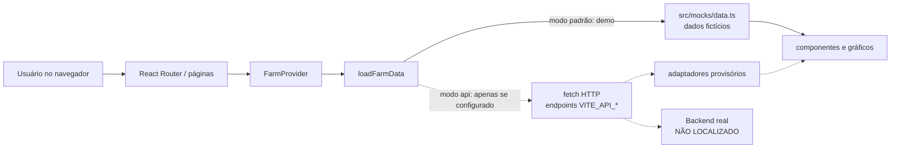

# Arquitetura atual

## Arquitetura comprovada

Somente a arquitetura do frontend pode ser reconstruída. Não há evidência de sensores, broker, processamento, bancos ou object storage.

Setas tracejadas representam caminhos condicionais não comprovados em execução real.

## Comunicação

- Frontend: SPA no navegador.
- Dados demonstrativos: import dinâmico local.
- Integração opcional: HTTP/JSON via `fetch`, `credentials: include`, `Accept: application/json`, timeout de 15 segundos.
- Formato aceito: array ou objeto `{ data: [...] }`.
- Não há WebSocket, SSE ou cliente MQTT no código.

## Serviços esperados pela atividade

| Tecnologia | Uso real encontrado | Justificativa baseada no projeto |
|---|---|---|
| MariaDB | não localizado | impossível justificar sem tabela ou fluxo comprovado |
| MongoDB | não localizado | apenas citado no README como storage a ser isolado atrás do backend |
| Redis | não localizado | impossível justificar sem chave ou consumidor comprovado |
| MQTT | não localizado | impossível justificar sem broker, tópico, publisher ou subscriber |
| MinIO | não localizado | somente recomendação genérica de URL assinada; nenhum bucket comprovado |

Não se deve criar uma justificativa genérica para essas tecnologias como se fossem parte da arquitetura atual.

## Frontend existente

As páginas exibem, no modo demo: resumo, talhões, detalhe de talhão, imagens, análises NDVI, alertas, máquinas, telemetria e configuração. O cliente calcula KPIs apenas sobre os registros carregados; não alega total do banco nem atualização em tempo real.

## Arquitetura de dados da fazenda

`INFORMAÇÃO NÃO LOCALIZADA — REQUER CONFIRMAÇÃO DO GRUPO` para origem, protocolo de ingestão, processamento, persistência, caches, object storage, consumidores e APIs reais.

