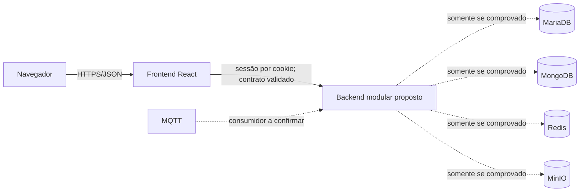

# Arquitetura proposta

## Decisão

Recomenda-se um **monólito modular**, condicionado à descoberta dos serviços reais. Para o prazo acadêmico e um frontend já existente, um único backend reduz deploy, autenticação, observabilidade e coordenação. Não há evidência que justifique microsserviços.

Isso é proposta, não descrição do ambiente atual.

## Componentes

1. Frontend React existente, reduzido às funcionalidades sustentadas pelos dados reais.
2. Backend/API único, a implementar somente depois de validar schemas e credenciais.
3. Serviços de dados preexistentes, se forem confirmados; não recriar nem migrar durante a auditoria.

Todos os serviços tracejados ainda carecem de evidência.

## Containers, portas, redes e volumes

| Componente proposto | Responsabilidade | Porta interna | Porta externa | Rede | Volume | Dependência |
|---|---|---|---|---|---|---|
| frontend | servir SPA | a definir para imagem de produção; 5173 é apenas dev atual | a definir após verificar ambiente-alvo | rede web proposta | nenhuma comprovada | backend/API |
| backend | autenticar, validar, paginar e mediar dados | a definir | preferir não expor diretamente; decisão depende do proxy | web + dados propostas | a definir somente se necessário | serviços reais confirmados |
| MariaDB/MongoDB/Redis/MQTT/MinIO | não criar nesta fase | `INFORMAÇÃO NÃO LOCALIZADA — REQUER CONFIRMAÇÃO DO GRUPO` | não expor sem necessidade | a confirmar | preservar volumes existentes | ambiente do grupo |

Não foram inventadas portas. Em 07/10/2026, 3306, 27017, 6379, 1883, 8883, 9000, 9001, 5173 e 4173 estavam livres localmente, mas isso não define o ambiente de entrega.

## Credenciais

Mecanismo atual comprovado: nenhum segredo configurado; `.env.example` contém apenas configuração pública Vite. O `fetch` envia cookies com `credentials: include`.

Proposta:

- guardar segredos somente no runtime do backend por variáveis de ambiente ou secrets da plataforma;
- manter `.env`/`.env.local` fora do Git;
- nunca inserir segredo em `VITE_*`;
- fornecer ao frontend apenas URL pública e caminhos não sensíveis;
- usar conta somente leitura durante descoberta e privilégio mínimo no MVP;
- gerar URLs temporárias no backend se objetos privados forem confirmados.

## Integração incremental

1. obter inventário e acesso somente leitura;
2. validar uma fonte e um caso de uso;
3. documentar contrato real;
4. implementar um módulo do backend e testes;
5. conectar no máximo três telas do frontend;
6. adicionar outras fontes apenas se indispensáveis ao caso de uso.

