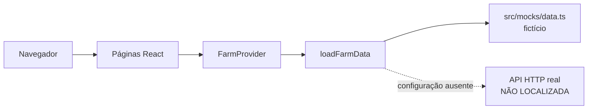
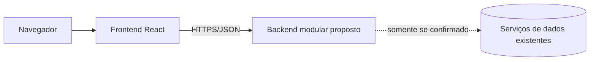

# P1 — Estudo dos dados, da arquitetura e escopo do sistema web

> **Status em 07/10/2026:** relatório de auditoria, ainda não apto à entrega final por ausência das fontes reais. Nenhum mock é apresentado como dado da fazenda.

## 1. Grupo e fazenda

- Número do grupo: `INFORMAÇÃO NÃO LOCALIZADA — REQUER CONFIRMAÇÃO DO GRUPO` (o nome do repositório contém “Grupo4”, mas isso não é confirmação acadêmica suficiente).
- Nome da fazenda: `INFORMAÇÃO NÃO LOCALIZADA — REQUER CONFIRMAÇÃO DO GRUPO`.
- Integrantes: `INFORMAÇÃO NÃO LOCALIZADA — REQUER CONFIRMAÇÃO DO GRUPO`.
- RA: `INFORMAÇÃO NÃO LOCALIZADA — REQUER CONFIRMAÇÃO DO GRUPO`.
- Repositório GitHub: `https://github.com/carlosvielf/Grupo4PI_ArqCloud.git`.
- Evidência auxiliar: Carlos Viel é o único autor observado nos três commits locais, mas autoria Git não comprova a lista oficial de integrantes.

## 2. Estudo dos dados

### Inventário real

| Serviço | Conteúdo | Quantidade | Período | Resultado da auditoria |
|---|---|---:|---|---|
| MariaDB | não localizado | não mensurável | não mensurável | porta 3306 fechada; sem config/schema |
| MongoDB | não localizado | não mensurável | não mensurável | porta 27017 fechada; sem config/modelos |
| Redis | não localizado | não mensurável | não mensurável | porta 6379 fechada; sem config |
| MQTT | não localizado | não mensurável | não mensurável | 1883/8883 fechadas; sem tópicos/config |
| MinIO | não localizado | não mensurável | não mensurável | 9000/9001 fechadas; sem buckets/config |

O repositório contém apenas dados fictícios de UI: 6 talhões, 48 imagens, 48 leituras NDVI, 4 alertas e 20 registros de telemetria. O próprio código declara que nenhum registro representa propriedade real. Por isso essas contagens não são respostas sobre a fazenda.

### Consultas, resultados e interpretação

Foram executadas consultas de auditoria de repositório, Docker, portas e configuração, detalhadas em `CONSULTAS_EVIDENCIAS.md`. As cinco consultas analíticas de negócio não puderam ser executadas porque não há fonte real acessível. Inventar SQL, collections, chaves, tópicos ou resultados violaria o critério da atividade.

### Perguntas de negócio

`INFORMAÇÃO NÃO LOCALIZADA — REQUER CONFIRMAÇÃO DO GRUPO`. Perguntas somente poderão ser selecionadas após o inventário real indicar quais grandezas, entidades e períodos existem.

## 3. Qualidade dos dados

Nenhum problema nos dados reais é afirmado. A fonte real não foi localizada, logo duplicidade, completude, validade, consistência, integridade e temporalidade não puderam ser medidas.

| Descrição | Detecção/consulta | Quantidade afetada | Impacto | Tratamento |
|---|---|---:|---|---|
| impossibilidade de auditar a base real | busca integral, Docker inacessível, portas fechadas | não mensurável | bloqueia contagens e escopo | fornecer acesso somente leitura e executar perfilamento |

O contrato provisório valida alguns formatos no cliente, mas isso não prova qualidade da base. Detalhes estão em `QUALIDADE_DADOS.md`.

## 4. Arquitetura atual

O único fluxo comprovado é o frontend consumindo mocks locais. Existe cliente HTTP configurável, porém nenhum endpoint real.



MariaDB, MongoDB, Redis, MQTT e MinIO não podem ser justificados como componentes atuais: nenhum uso real foi encontrado. A API simulada dos testes é interceptação Playwright, não backend.

## 5. Escopo do sistema web

### Problema, persona e objetivo

- Persona: `INFORMAÇÃO NÃO LOCALIZADA — REQUER CONFIRMAÇÃO DO GRUPO`.
- Problema comprovado: o frontend existente não está conectado a fontes reais.
- Objetivo proposto: conectar um único caso de uso comprovado, com rastreabilidade e sem fallback fictício.

### Proposta escolhida

Entre integrar o frontend de forma incremental, assumir um dashboard NDVI ou assumir telemetria, recomenda-se a integração incremental. NDVI, imagens, máquinas e alertas aparecem somente nos mocks e não devem ser aprovados como escopo da fazenda antes da auditoria das fontes.

### Requisitos funcionais

| ID | Requisito | Usuário | Dados necessários | Serviço de origem |
|---|---|---|---|---|
| RF01 | exibir disponibilidade dos recursos configurados | a confirmar | sucesso/erro HTTP | frontend/API configurada |
| RF02 | listar o primeiro recurso real aprovado | a confirmar | contrato real | a descobrir |
| RF03 | filtrar por campos comprovados | a confirmar | schema/domínios reais | a descobrir |
| RF04 | exibir detalhe do registro | a confirmar | ID estável/payload real | a descobrir |
| RF05 | mostrar falhas sem usar mocks | a confirmar | erro HTTP | frontend existente |

RF02–RF04 são condicionais e não estão aprovados.

### Requisitos não funcionais

- RNF01: segredos nunca entram em `VITE_*` ou no bundle.
- RNF02: bancos/storage são acessados somente pelo backend.
- RNF03: manter estados de carregamento, vazio e erro.
- RNF04: manter responsividade e acessibilidade já documentadas.
- RNF05: registrar falhas por recurso sem fallback fictício.
- RNF06: definir métricas de desempenho após medir o ambiente real.

### Telas e wireframes

Três telas candidatas: Estado das fontes, Lista do recurso aprovado e Detalhe do registro. Wireframes completos estão em `ESCOPO_SISTEMA_WEB.md`.

```text
[Estado das fontes] -> [Lista do recurso real] -> [Detalhe]
      comprovada          condicionada              condicionada
```

### Tela → informação → serviço

| Tela | Informação | Serviço | Estrutura | Evidência |
|---|---|---|---|---|
| Estado das fontes | recursos configurados e erros | frontend | `endpointConfig`/`ResourceIssue` | código existente |
| Lista | campos reais a descobrir | não localizado | não localizada | pendente |
| Detalhe | registro/relações reais | não localizado | não localizada | pendente |

## 6. Arquitetura proposta e plano

### Monólito ou microsserviços

Recomenda-se monólito modular: um backend para autenticação, validação, paginação e mediação dos serviços confirmados, aproveitando o frontend atual. Microsserviços adicionariam complexidade sem requisito comprovado.



### Containers e portas

Não há containers atuais. Frontend e backend são componentes propostos; portas de produção, redes e volumes dependem do ambiente real. As portas 5173 e 4173 são apenas as portas atuais de desenvolvimento/preview. Não foram inventadas portas para banco ou backend.

### Credenciais

Segredos devem entrar somente no runtime do backend por variáveis protegidas/secrets. `.env` permanece fora do Git. Configuração `VITE_*` é pública. Nenhum segredo aparente foi encontrado por busca nominal nos arquivos de projeto rastreados.

### Cronograma até 17/11/2026

- 07–16/10: obter metadados, infraestrutura, dados e consultas reais.
- 15–19/10: validar persona/caso de uso e congelar três telas.
- 20–27/10: backend e contrato.
- 26/10–03/11: integração do frontend.
- 02–11/11: validação, testes e correções.
- 10–16/11: documentação, ensaio e congelamento.
- 17/11: entrega.

### Divisão

Todos os responsáveis permanecem `INTEGRANTE A DEFINIR`: dados/infraestrutura; backend/segurança; frontend/acessibilidade; qualidade/documentação. A lista oficial e o tamanho da equipe não foram encontrados, portanto não foi inventada uma atribuição nominal.

### Pendências impeditivas

1. confirmar grupo, fazenda, integrantes e RAs;
2. fornecer arquitetura/configuração e acesso somente leitura aos serviços;
3. executar cinco ou mais consultas reais;
4. medir qualidade e período;
5. validar persona e caso de uso;
6. definir portas/containers somente após conhecer o ambiente.

